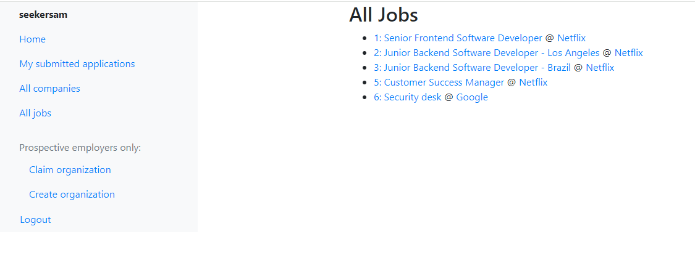
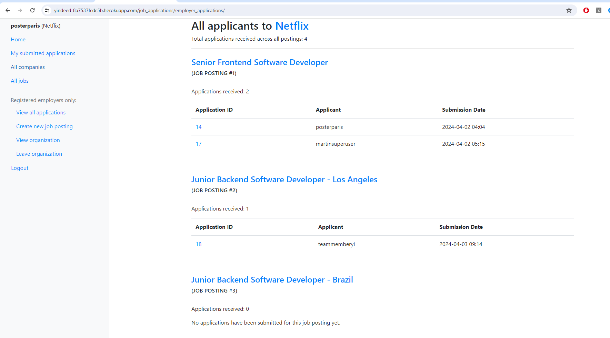

# Yindeed (Indeed.com clone)

As a job-seeker, looking at available jobs before applying:

As an internal recruiter, browsing submitted job applications

As an internal recruiter, inspecting a specific applicant and his downloadable resume

See a live demo hosted on Heroku at:
[https://yindeed-8a7537fcdc5b.herokuapp.com/](https://yindeed-8a7537fcdc5b.herokuapp.com/).

## Author's context:
    
My professional background is being a sales/finance/ops/product leader in startups. A year ago, I was completely non-technical. Although I had one prior CRUD/Django project under my belt:
1. its production was carried by a Mozilla tutorial where I copy/pasted much of the code without understanding
2. it only had one app, blurring the lines between app and project
3. it had an uncommon file hierarchy that blocked deployment 

In this project however, I:
1. generated the entire idea alone: database models, back-end logic, and front-end interface
2. coded out the entire project without assistance from another person or tutorial
3. successfully deployed the web site onto Heroku
 

## Idea summary:
Yindeed" is a simplified job-posting board. Select users may represent employer organizations, post new jobs, and review submitted applications. Job seekers can browse all hiring orgs, open jobs, and track which openings they've applied to.

## New technical achievements:
1. used Django built-in tools to create a user registration + authentication system with group-related permissions
2. designed and linked multiple apps which managed relationships between users, hiring orgs, job postings, and job applications
3. implemented file uploading + downloading with file format and file size limitations
4. deployed project on the Heroku web-hosting platform

## Learnings:
>**APP STRUCTURE**: I placed employer organizations and job openings within the same app. Giving each a separate app would have improved extensibility.

>**DATABASE/STORAGE**: SQLite won't support persistent data on Heroku, pointing me to Postgres. There is a material difference in structured (job postings) vs unstructured data (the resume PDFs), with the second leading me to Amazon S3.

>**SCOPE CREEP**: I barely made my 14-day deadline by sacrificing a lot of enticing features and enhancements (see below). 

## Feature considerations:
   * user profiles, which could have aided in auto-filling job applications
   * company tags for industry
   * job posting tags for role-level or function (e.g. sales vs. engineering)
   * e-mail confirmations
   * job application stages/status
   * applicant's ability to withdraw an application
   * publicizing an org's representatives
   * session statistics e.g. how many times an app has been viewed or how many views does an applicant have across all apps
